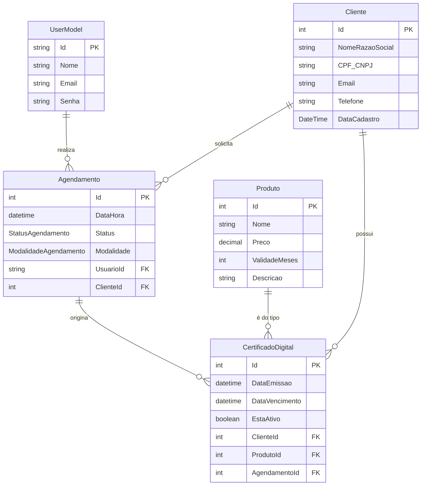

## **Documentação do Projeto Final – CertiNet**

**Autor:** Pedro Liu | 
**Disciplina:** Framework para Desenvolvimento Web I | 
**Professor:** Rômulo 

-----

### **1. Visão Geral do Projeto**

O CertiNet é um sistema web que simula uma plataforma interna para o gerenciamento do ciclo de vida de certificados digitais. O projeto foi concebido para atender a um cenário de negócio real, onde uma empresa prestadora de serviços (como uma Autoridade de Registro) precisa administrar seus clientes, produtos (tipos de certificados), agendamentos e o controle de vendas.

O sistema possui um painel administrativo com diferentes níveis de acesso, permitindo a gestão completa das entidades do negócio e a extração de relatórios gerenciais para tomada de decisão.

### **2. Tecnologias Utilizadas**

O projeto foi desenvolvido sobre a plataforma .NET, utilizando as seguintes tecnologias e padrões:

  * **Back-end:** C\# com ASP.NET Core 6 MVC
  * **Acesso a Dados:** Entity Framework Core 6
  * **Banco de Dados:** SQL Server
  * **Autenticação e Autorização:** ASP.NET Core Identity com sistema de Roles (Perfis)
  * **Front-end:** HTML5, CSS3, JavaScript
  * **Frameworks de UI:** Bootstrap 5, jQuery

### **3. Arquitetura e Estrutura do Projeto**

A aplicação foi estruturada seguindo o padrão **Model-View-Controller (MVC)**.

  * **`Models`**: Contém as classes de domínio (`Cliente`, `Produto`, etc.) que representam as tabelas do banco de dados, e os `ViewModels`, classes específicas para moldar os dados para as telas de relatórios e formulários complexos.
  * **`Views`**: Contém os arquivos `.cshtml` responsáveis pela interface do usuário, utilizando a sintaxe Razor para renderizar o HTML dinamicamente.
  * **`Controllers`**: Contém as classes que orquestram o fluxo da aplicação, recebendo as requisições do usuário, interagindo com os Models para acessar o banco de dados e selecionando a View apropriada para retornar a resposta.
  * **`Data`**: Contém a classe `DbContext` e os arquivos de `Migration`, responsáveis pela comunicação com o banco de dados.
  * **`Areas/Identity`**: Contém toda a estrutura de autenticação e gerenciamento de perfil de usuário, gerada pelo scaffolding do ASP.NET Core Identity.

### **4. Modelo de Dados (Entidades)**

O sistema foi modelado com um banco de dados relacional, gerenciado pelo Entity Framework Core. O projeto possui **6 entidades principais**, superando o requisito mínimo de 5.

  * **UserModel (Usuário):** Herda de `IdentityUser`, representa os usuários do sistema (Admin, Agente de Registro).
  * **Cliente:** Armazena os dados dos clientes que adquirem os certificados.
  * **Produto:** Funciona como um catálogo de serviços, detalhando os tipos de certificados, preços e validades.
  * **Agendamento:** Gerencia os horários de validação dos certificados, ligando um Cliente a um Agente.
  * **CertificadoDigital:** Representa a "venda" final, vinculando um Cliente, um Produto e o Agendamento que o originou.
  * **Roles (Perfis):** Tabela do Identity para gerenciar os perfis "Admin" e "AgenteDeRegistro".

#### **Diagrama de Entidade-Relacionamento (DER)**

### **5. Funcionalidades Implementadas**

#### **5.1. Autenticação e Autorização**

O sistema utiliza ASP.NET Core Identity para um controle de acesso seguro baseado em perfis (Roles):

  * **Admin:** Tem acesso total ao sistema, incluindo o gerenciamento de outros usuários.
  * **AgenteDeRegistro:** Tem acesso às funcionalidades operacionais, como gestão de clientes, agendamentos e certificados.
  * Menus e botões são exibidos dinamicamente de acordo com o perfil do usuário logado.

#### **5.2. Painel Administrativo (CRUD)**

Foram implementadas operações CRUD (Create, Read, Update, Delete) completas para todas as entidades principais, com formulários, validações e listagens paginadas:

1.  Gerenciamento de **Clientes**
2.  Gerenciamento de **Produtos** (tipos de certificado)
3.  Gerenciamento de **Agendamentos**
4.  Gerenciamento de **Certificados Digitais**
5.  Gerenciamento de **Usuários** (acessível apenas pelo Admin)

#### **5.3. Módulo de Relatórios (Desafio Atendido)**

Uma área dedicada (`/Relatorios`) foi criada, apresentando relatórios gerenciais para análise:

  * **Certificados Próximos do Vencimento:** Lista certificados que expiram em 30, 60 ou 90 dias, essencial para o processo de renovação.
  * **Performance Financeira dos Agentes:** Relatório avançado que calcula o valor total em vendas gerado por cada agente, cruzando dados de múltiplas tabelas.

#### **5.4. Mecanismos de Busca (Desafio Atendido)**

As principais telas de listagem (`Index`) foram equipadas com filtros de busca, permitindo ao usuário encontrar rapidamente:

  * **Clientes:** por Nome ou CPF/CNPJ.
  * **Certificados:** por CPF/CNPJ do cliente titular.
  * **Agendamentos:** por data.
  * **Relatórios:** por nome do agente.

### **6. Conclusão**

Foi construído um sistema web funcional, robusto e seguro, aplicando os conceitos de MVC, Entity Framework Core e ASP.NET Core Identity. Além das funcionalidades básicas de CRUD, foram implementados desafios como um módulo de relatórios avançado e mecanismos de busca, resultando em uma aplicação completa e com grande valor de negócio simulado.
